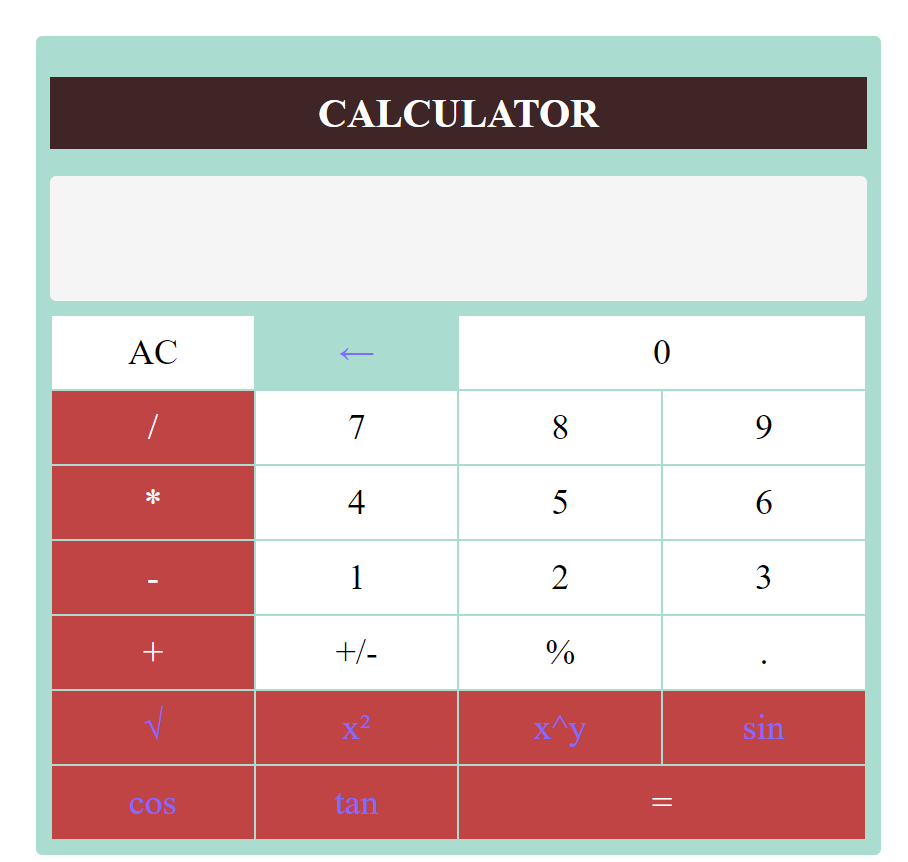

# Engineering Calculator

A versatile web-based calculator that provides both basic and engineering functionalities. This calculator supports standard arithmetic operations and includes advanced features such as square root, square, exponentiation, and trigonometric functions (sin, cos, tan).

## Features

- Basic arithmetic operations: addition (+), subtraction (-), multiplication (*), division (/)
- Additional operations: square root (√), square (x²), exponentiation (x^y)
- Trigonometric functions: sine (sin), cosine (cos), tangent (tan)
- Percentage calculation (%)
- Change sign (+/-)
- Clear display (AC)
- Backspace to delete the last entered digit (←)




## Input Methods

#### The calculator supports input from both the keyboard and by clicking on the calculator buttons. Additionally, keyboard input allows for easy and efficient calculation, making it accessible to users who prefer different input methods.

## Usage

1. Clone the repository:

   ```bash
   git clone https://github.com/Adarsh-0001/calculator
2. Open index.html in your web browser.

3. Use the calculator to perform various mathematical operations.

## Technologies Used
##### HTML
##### CSS
##### JavaScript

## Contributing
Contributions are welcome! If you have any suggestions or improvements, feel free to create an issue or submit a pull request.

## License
This project is licensed under the MIT License.
